# Perfil do Usuário

Para traçar o perfil dos possíveis usuários do aplicativo da Caesb, optamos por utilizar um questionário como instrumento de pesquisa. O questionário é uma técnica de coleta de dados muito utilizada em pesquisas quantitativas, pois permite obter informações sobre as características dos respondentes de forma padronizada e objetiva.

O questionário foi desenvolvido com perguntas específicas sobre o uso do aplicativo, como por exemplo, se já haviam utilizado o aplicativo da Caesb, qual a frequência de uso, quais as funcionalidades mais utilizadas, entre outras.

Além disso, também foram incluídas perguntas sobre as características socioeconômicas dos possíveis usuários, como idade, gênero e escolaridade, para que pudéssemos entender melhor o perfil dos respondentes.

O questionário foi desenvolvido utilizando o Google Forms e divulgado por meio de redes sociais.

Com as informações obtidas através do questionário, foi possível traçar o perfil dos possíveis usuários do aplicativo da Caesb, identificando as características mais comuns entre eles, como faixa etária, nível de escolaridade e frequência de uso de aplicativos da Caesb.

## Vantagens

A utilização de questionários nos traz como vantagem:

<ul>
    <li> 
        Padronização dos dados: garante que todas as informações sejam obtidas de forma uniforme, facilitando análises posteriores;
    </li>
    <li> 
        Rapidez: permite a coleta de um grande número de dados em um pequeno espaço de tempo;
    </li>
    <li> 
        Redução de erros: devido a padronização, a utilização de formulários reduz a ocorrência de erros de preenchimento.
    </li>
</ul>

## Desvantagens 

A utilização de questionários nos traz como desvantagem:

<ul>
    <li> 
        Restições a opções de resposta: apesar de a padronização de respostas também poder ser considerada uma vantagem, ela pode atrapalhar ao limitar as possibilidades de respostas dos participantes;
    </li>
    <li> 
        Dificuldade de interpretar algumas respostas: em alguns casos, as respostas dos participantes podem não ser claras o suficiente, atrapalhando a análise dos dados.
    </li>
    <li> 
        Baixa taxa de resposta: A aplicação de formulários pode resultar em uma baixa taxa de resposta, o que pode comprometer a representatividade dos resultados;
    </li>
</ul>

## Planejamento

Para a confecção do questionário, primeiramente foi pensado em um termo de consentimento para que os participantes tivessem ciência do que se travata a pesquisa e que seus dados seriam utilizados para o andamento da mesma. O termo pode ser lido abaixo: 

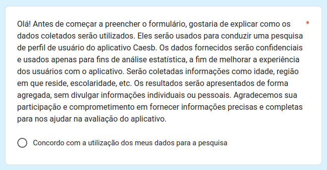

Imagem 1: Termo de Consentimento (Fonte: autor, 2023).

Em seguida, debatemos quais informações desejávamos descobrir sobre os usuários da plataforma:

<ul>
    <li>
        Qual a idade dos usuários? Usuários mais velhos costumam usar mais o aplicativo? 
    </li>
    <li>
        Onde o usuário reside? Uma pessoa de outra região tem motivos para usar o aplicativo? 
    </li>
    <li>
        Qual o nível de escolaridade do usuário? Usuários com mais instrução tendem a usar mais o aplicativo?
    </li>
    <li>
        Os usuários são empregados? Dessa forma, utilizariam o aplicativo para pagar suas contas?
    </li>
    <li>
        Como os usuários aprenderam a usar o aplicativo? O aplicativo é intuitivo ou precisam de instruções?
    </li>
    <li>
        Para que os usuários utilizam o aplicativo?
    </li>
    <li>
        Para que os usuários utilizam o aplicativo? Eles o utilizam para ajudar outra a pessoa? Com que frequência?
    </li>
    <li>
        Os usuários já estão acostumados a usar outros aplicativos do governo? 
    </li>
    <li>
        O que os usuários acham do aplicativo? Precis ade novas funcionalidades? 
    </li>
</ul>

Com base nessas dúvidas, foram elaboradas 12 questões, abertas e objetivas, com o intuito de coletar dados que achavamos relevantes para traçar o perfil do usuário. Para isso, utilizamos como base o livro Interação Humano Computador dos autores Simone Barbosa e Bruno Silva. As 12 questões formuladas são listadas a baixo:

<ul>
    <li>
        Qual sua faixa etária?
    </li>
    <li>
        Em que região você reside?
    </li>
    <li>
        Qual seu nível de escolaridade?
    </li>
    <li>
        Você trabalha? Se sim, qual cargo?
    </li>
    <li>
        Você utiliza o aplicativo da Caesb?
    </li>
    <li>
        Como você aprendeu a usar o aplicativo?
    </li>
    <li>
        Qual é seu principal objetivo ao utilizar o aplicativo da Caesb?
    </li>
    <li>
        Com qual frequência você utiliza o aplicativo da Caesb?
    </li>
    <li>
        Você utiliza o aplicativo para ajudar outra pessoa?
    </li>
    <li>
        Você utiliza outros aplicativos do governo? Se sim, quais?
    </li>
    <li>
        Você acredita que o aplicativo da Caesb atende às suas necessidades? Se não, o que gostaria de ver no aplicativo?
    </li>
    <li>
        Em uma escala de 1 a 5, qual sua avaliação geral do aplicativo da Caesb?
    </li>
</ul>

Mais uma questão extra para o participante colocar seu email caso queira nos ajudar posteriormente.

## Resultados

O grupo se empenhou para divulgar o questionário de forma que abrangesse os mais diferentes grupos. Ao todo, foram coletadas de 74 pessoas no período de 3 dias (26/04 - 29/04), sendo apenas 8 pessoas usuárias do aplicativo, como pode ser visto na imagem 6. Os resultados são apresentados nas tabelas X a X e também podem ser observados na seguinte [planilha](https://docs.google.com/spreadsheets/d/1plYsrgyynyxRI8Q3QcpB23xFr63V0256jp9bSyTAsZU/edit?usp=sharing).

### Resultado Geral

- Faixa etária

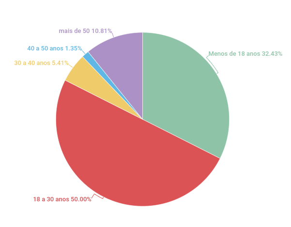

Imagem 2: Idade dos Participantes (Fonte: autor, 2023).

Como podemos ver na imagem 2, a maioria dos participantes possuem idade entre 18 a 30 anos.

- Região que o participante reside

Imagem 3: Região de Residência dos Participantes (Fonte: autor, 2023).

Como podemos ver na imagem 3, a maioria dos participantes residem da região Centro-Oeste.

- Nível de escolaridade

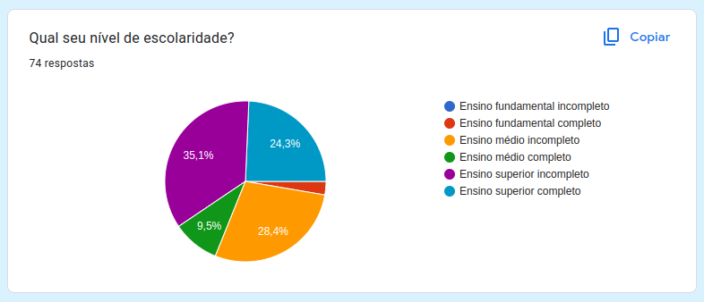

Imagem 4: Nível de Escolaridade (Fonte: autor, 2023).

Como podemos ver na imagem 4, a maioria dos participantes possuem ensino superior incompleto.

- Quantidade de pessoas empregadas

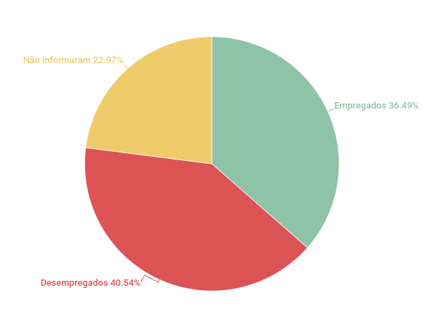

Imagem 5: Nível de Empregabilidade (Fonte: autor, 2023).

Como podemos ver na imagem 5, os participantes, de forma geral, possuem um nível bem dividido de empregabilidade. Foram coletados dados de desenvolvedores a dentistas, o que pode ser observado no seguinte [planilha](https://docs.google.com/spreadsheets/d/1plYsrgyynyxRI8Q3QcpB23xFr63V0256jp9bSyTAsZU/edit?usp=sharing).

- Quantidade de pessoas que utilizam o aplicativo

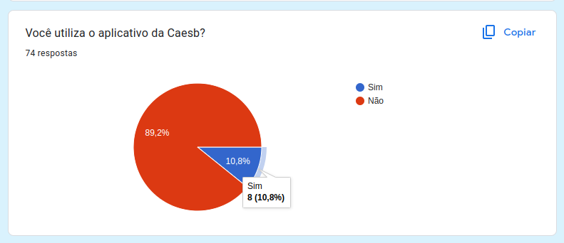

Imagem 6: Pessoas que Utilizam o Aplicativo (Fonte: autor, 2023).

Como podemos ver na imagem 6, poucas pessoas utilizam o aplicativo, totalizam 8 apenas.

### Resultado dos Usuários

#### Informações gerais dos usuários

Nessa seção, vamos apresentar os dados dos participantes que também são usuários do aplicativo Caesb.

- Faixa etária

A maioria dos usuários possuem entre 18 a 30 anos, sendo apenas uma com mais de 50 anos.

- Região que o usuário reside

Foi observado que todos os usuários residem na região Centro-Oeste.

- Nível de escolaridade

Foi observado que todos os usuários possuem pelo menos o ensino superior incompleto.

- Quantidade de usuários empregados

Foi observado que todos os usuários então empregados.

#### Sobre o aplicativo

- Como os usuários aprenderam a usar o aplicativo?

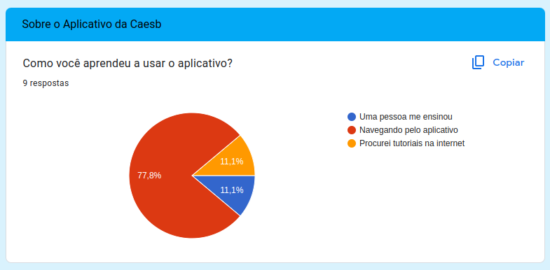

Imagem 7: Aprendizado do Aplicativo (Fonte: autor, 2023).

Como podemos ver na imagem 7, a maioria dos usuários aprenderam a utilizar o aplicativo navegando pelo mesmo.

- Para que os usuários utilizam o aplicativo?

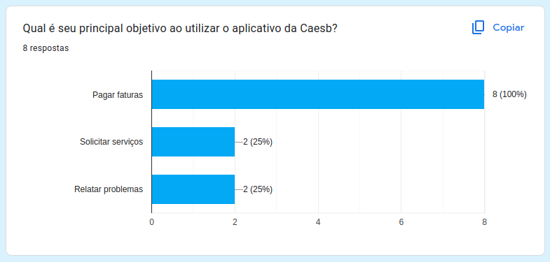

Imagem 8: Principal Ferramenta do Aplicativo (Fonte: autor, 2023).

Como podemos ver na imagem 8, a principal funcionalidade utilizada pelos usuário é a de pagamento de faturas.

- Com qual frequência os usuários utilizam o aplicativo?

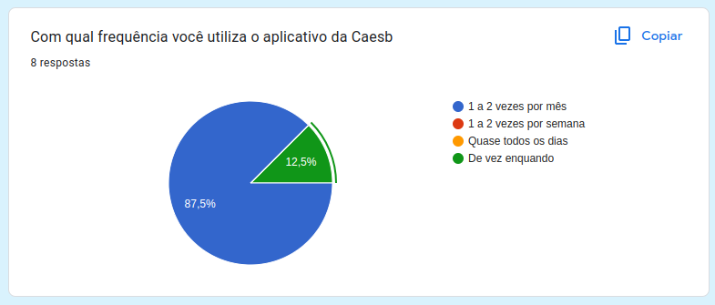

Imagem 9: Principal Ferramenta do Aplicativo (Fonte: autor, 2023).

Como podemos ver na imagem 9, a maioria dos usuários utilizam o aplicativo de 1 a 2 vezes por mês.

- Os usuários utilizam o aplicativo para ajudar outras pessoas?

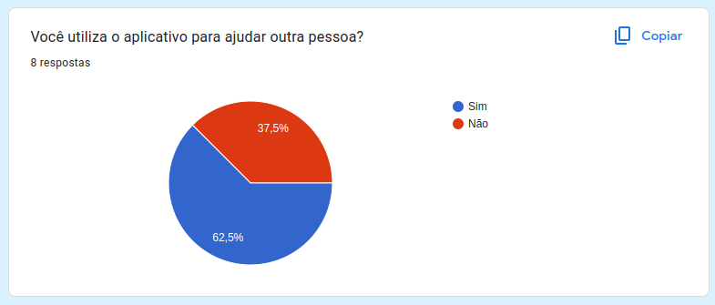

Imagem 10: Usuários que ajudam outras pessoas. (Fonte: autor, 2023).

Como podemos ver na imagem 10, a maioria dos usuários utilizam o aplicativo para ajudar outras pessoas.

- Os usuários utilizam outros aplicativos do governo?

Segundo os dados coletados, apenas 2 entre os 8 usuários analisados não usam outros sites do governo.

- Os usuários acham que o aplicativo atende a suas necessidades?

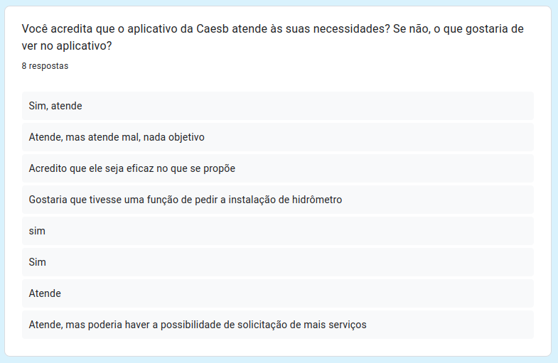

Imagem 11: Necessidades dos usuários. (Fonte: autor, 2023).

Segundo os dados coletados, os usuários acreditam que o aplicativo os atende bem, porém necessita da implentação de algumas fucionalidades e melhorias relacionadas a experiência do usuário.

- Qual nota os usuários dão para o aplicativo?

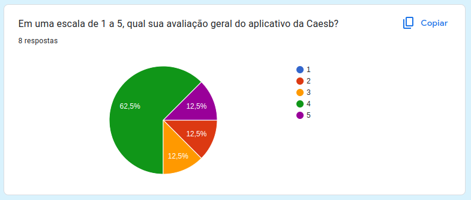

Imagem 12: Nota dos usuários para o aplicativo. (Fonte: autor, 2023).

Segundo os dados coletados, o aplicativo tem uma nota média de 3,75.

## Reflexões

A partir dos dados apresentados acima chegamos a algumas conclusões sobre os principais usuários do aplicativo:

<ul>
    <li>
        Os usuários possuem de 18 a 30 anos;
    </li>
    <li>
        Os usuários residem na região Centro-Oeste;
    </li>
    <li>
        Os usuários possuem pelo menos ensino superior incompleto;
    </li>
    <li>
        Os usuários possuem emprego;
    </li>
    <li>
        Os usuários aprendem a utilizar o aplicativo navegando por ele;
    </li>
    <li>
        A principal funcionalidade utiliza pelos usuários é a de pagar faturas;
    </li>
    <li>
        Os usuários utilizam o aplicativo de 1 a 2 vezes por mês;
    </li>
    <li>
        Os usuários utilizam o aplicativo para ajudar outras pessoas;
    </li>
    <li>
        Os usuários utilizam outros aplicativos do governo;
    </li>
    <li>
        Os usuários acham que o aplicativo os atende, mas que deve haver algumas melhorias e novas funcionalidades.
    </li>
</ul>

## Referências

> BARBOSA, Simone; SILVA, Bruno. Interação humano-computador. 2. ed. Rio de Janeiro: Elsevier, 2010.

## Histórico de Versão
|    Data    | Data Prevista de Revisão | Versão |      Descrição       |                                                                Autor                                                                 |               Revisor               |
| :--------: | :----------------------: | :----: | :------------------: | :----------------------------------------------------------------------------------------------------------------------------------: | :---------------------------------: |
| 15/04/2023 |        15/04/2023        |  1.0   | Criação do documento | [Carla](https://github.com/ccarlaa) e [Daniel](https://github.com/daniel-de-sousa)| [Paulo](https://github.com/PauloVictorFS) |
