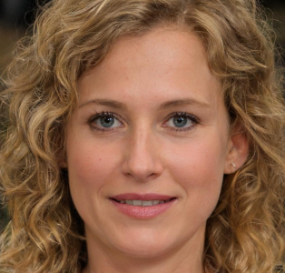

## Introdução

Personas são personagens fictícios, arquétipo hipotético de um grupo de usuários reais, sendo criada para poder descrever um usuário típico. Seu objetivo é representar um grupo de usuários finais, representando como ele se comporta, como pensa, seus objetivos e suas motivações.

Elas são uma ferramenta que pode se apresentar em mais de uma fase de um projeto, sendo uma ferramenta muito importante tanto na questão de elicitação de requisitos como na questão de decisões de design. Desse modo faz com que todos fiquem focados no mesmo alvo.

## Metodologia

Personas são definidas a partir do momento que se realiza um estudo de campo para descobrir quais as características dos usuários do produto, tendo esses dados em mão, são criadas as personas se referenciando neles, sendo que cada um apresenta características significativas.

Isso faz com que não se tenha um usuário elástico, a partir do momento que uma persona perde essa elasticidade, é possível identificar suas habilidades, motivações e o que ela quer alcançar, tornando claro os objetivos dos usuários para que se possa ver o que o produto deve fazer ou pode deixar de fazer.

## Elenco de Personas

Tendo em vista a fala de Courage e Baxter sobre a quantidade do elenco de personas, foram definidos que o projeto possuiria uma quantidade de 3 personas, sendo 2 primária e 1 antipersona. Essa quantidade foi escolhida para se ter personas significativas, memoráveis e que representasse bem os usuários e suas características, poís no perfil de usuário foram identificados dois  tipos de usuários principais, aqueles que usam o aplciativo para benefício próprio e aqueles que usam para ajudar outras pessoas, como também aqueles que não o utilizam. 

O objetivo das Personas é que se tenha bem em mente para quem o software foi projetado e para quem não foi, por isso, para a construção dessas personas, foram baseadas nos dados levantados pelos usuários, através de um formulário online.

Para gerar cada imagem de persona foi usada a ferramenta This Person Doest Not Exist.

Elas podem ser vistas na seguinte ordem:

Tabela 1 - Persona 1 | Persona Primária 
Tabela 2 - Persona 2 | Persona Primária 
Tabela 3 - Persona 3 | Antipersona

 

|          Persona          |          Primária          |
|:-------------------------:|:--------------------------:|
|           Nome            |      Ana Paula Silva       |
|           Idade           |           30 Anos          |
|        Localização        | Distrito Federal, Brasília |
|            Foto           | Imagem 1 - Ana Paula Silva. (Fonte: This Person Does Not Exist)|
|           Status          |      Persona Primária      |
|         Objetivos         |Ana quer se sentir no controle de suas finanças, gerenciando seus gastos de forma eficiente. Ana deseja ser produtiva no seu estágio e aprender bastante. Ela quer manter uma reserva para imprevistos e economizar para fazer viagens. Ela quer manter uma rotina saudável com dieta e exercícios.|
|        Habilidades        |Ana está se formando em administração de empresas com ênfase em finanças. Ela tem habilidade em planejamento financeiro e orçamento pessoal Possui conhecimentos avançados em Excel e outras ferramentas de gestão financeira.|
|          Tarefas          |Ana tem aula da faculdade de manhã e faz estágio a tarde.  Ela registra e categoriza suas despesas para encontrar locais onde pode economizar. Ana separa um tempo no fim de semana para passear com seu marido.|
|      Relacionamentos      |Marido: Luiz(32 Anos, Farmacêutico) Amigos de Infância: Ana tem um grupo de amigos desde pequena até hoje.  Amigos da Faculdade: Grupo de pessoas que Ana conheceu na faculdade que combinam de pegar matéria juntos. Amigos do Trabalho: Algumas pessoas no seu trabalho que ela tem uma boa convicência.|
|        Requisitos         |Ana presa pela simplicidade, desejando que o aplicativo apresente todos os dados necessários de maneira veloz, tendo os seguintes pensamentos: "É importante que o aplicativo seja fácil e intuitivo para realizar mais rápido as tarefas." "Eu gostaria de receber alerta quando minha conta de água estiver prestes a vencer." "É importante para mim ter acesso a relatórios e gráficos para entender melhor meus gastos."|
|        Expectativas       |Ana espera que o aplicativo seja intuitivo. Ela acredita que o aplicativo vai facilitar o gerenciamento e pagamento de suas contas. Ela espera que o aplicativo seja seguro e proteja suas informações pessoais. Ana espera que se precisar de um serviço possa realizar todo o processo de solicitação pelo aplicativo.|

Tabela 1 - Persona: Ana. (Fonte: Autores, 2023)

 

|          Persona          |          Primária          |
|:-------------------------:|:--------------------------:|
|           Nome            |  Guilherme Silva Andrade   |
|           Idade           |           25 Anos          |
|        Localização        | Distrito Federal, Brasília |
|            Foto           | Imagem 2 - Guilherme Silva Andrade. (Fonte: This Person Does Not Exist)|
|           Status          |      Persona Primária      |
|         Objetivos         |Guilherme deseja reduzir o consumo de água e o desperdício. Ele deseja retomar sua formatura em engenharia ambiental. Ele espera trocar seu emprego atual por um estágio de meio período. Guilherme quer ter um estilo de vida mais sustentável e eficiente.|
|        Habilidades        |Guilherme tem grande conhecimento sobre recursos naturais. Guilherme conhece muito sobre o desenvolvimento sustentável e diversas formas de reciclagem e reutilização de diversos produtos. Ele tem habilidade como atendente de uma loja de venda de chinelos.|
|          Tarefas          |Guilherme trabalha como atendente da loja de chinelos perto de sua casa para poder ajudar em casa. A pedido dos seus pais ele usa o aplicativo da CAESB para pode ver a conta e realizar o pagamento. Guilherme estuda sempre que tem tempo para quando voltar para faculdade ter o conhecimento fresco na mente. Ele gosta de aplicar o que já aprendeu em sua própria casam alertando seus pais do consumo de água e desperdício.|
|      Relacionamentos      |Pais: Carlos(50 anos, Vendedor ambulante), Cleide(53 anos, Dona de casa). Grupo do Trabalho: Pessoas que ele convive no trabalho. Grupo da Faculdade: Os amigos que ele conheceu na faculdade.|
|        Requisitos         |Guilherme não tem muito tempo por sempre estar trabalhando ou estudando, presando muito por velocidade, tendo os seguintes pensamentos: "Eu preciso que a interface seja intuitiva para que eu não perca tempo tentando aprender a usar." "Preciso que de para realizar tudo dentro do próprio aplicativo." "Eu gostaria de poder receber notificações sobre meu consumo e sobre quando minha conta estiver para vencer."|
|        Expectativas       |Guilherme espera que o aplicativo seja veloz na realização das tarefas. Ele deseja que tudo o que precise para cada tarefa esteja dentro do próprio aplicativo. Ele espera que as informações sejam claras e objetivas para não precisar perder muito tempo analisando elas.|

Tabela 2 - Persona: Guilherme. (Fonte: Autores, 2023)

 

|          Persona          |         Antipersona        |
|:-------------------------:|:--------------------------:|
|           Nome            |    João da Silva Pereira   |
|           Idade           |           20 Anos          |
|        Localização        | Distrito Federal, Brasília |
|            Foto           | Imagem 3 - João da Silva Pereira. (Fonte: This Person Does Not Exist)|
|           Status          |         Antipersona        |
|         Objetivos         |João deseja ser produtivo nos seus estudos da faculdade. Ele quer ter uma alimentação mais saudável. Ele deseja praticar mais seu esporte favorito, o Futebol. João deseja subir de cargo na empresa do seu pai onde trabalha como auxiliar de técnico em informática|
|        Habilidades        |João tem conhecimentos avançados do pacote office. Ele tem conhecimento em algumas linguagens de programação. João possui inglês básico devido ao seu contato com documentações de linguagens de programação.|
|          Tarefas          |João tem como tarefa principal aprender mais trabalhando e ser promovido. Ele deseja avançar no mundo da informática e para isso ele quer entrar na faculdade. Em casa suas tarefas são sempre lavar a louça e limpar a casa.|
|      Relacionamentos      |Pais: Cesar(43 anos,  Empresário do ramo de Edifícios), Claudia(45 anos, Dona de casa) Grupo do Trabalho: Pessoas que ele conheceu no trabalho com quem às vezes sai. Namorada: Daniela(21 anos, Pedicure)|
|        Requisitos         |João utilizou o aplicativo apenas uma vez, quando foi incumbido de pagar as contas e acabou perdendo a conta de água e por isso precisou de uma segunda via. Por isso, João não se enquadra na parte de ter requisitos no aplicativo.|
|        Expectativas       |Ele espera um dia assumir a empresa de seu pai. João quer se aprofundar na área de tecnologia. Ele deseja aprender mais sobre automação, pois acredita que é muto útil no dia a dia|

Tabela 3 - Persona: João. (Fonte: Autores, 2023)

 

## Referências Bibliográficas

> This Person Doesn't Exist, disponível no [link](https://this-person-does-not-exist.com/en). - Acesso em 30 de Abril de 2023
## Bibliografia

BARBOSA, SIMONE DINIZ JUNQUEIRO; SILVA, BRUNO SANTANA DA, Interação Humano-Computador e Experiência do Usuário, 1ª Edição, Capítulo 8, Editora Campus, 2010

## Histórico de Versão
|    Data    | Data Prevista de Revisão | Versão |      Descrição       |                                         Autor                                          |               Revisor               |
| :--------: | :----------------------: | :----: | :------------------: | :------------------------------------------------------------------------------------: | :---------------------------------: |
| 30/04/2023 |        01/05/2023        |  1.0   | Criação do documento | [Daniel](https://github.com/daniel-de-sousa) e [Carla](https://github.com/ccarlaa) | [Paulo](https://github.com/PauloVictorFS) |