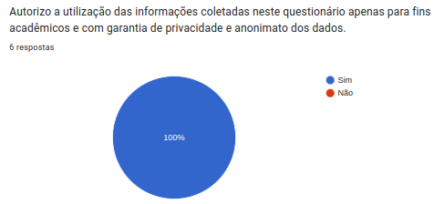
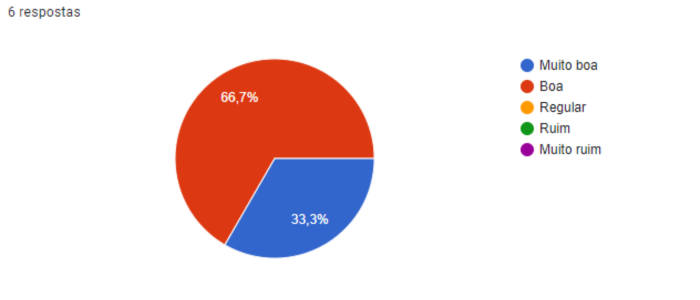
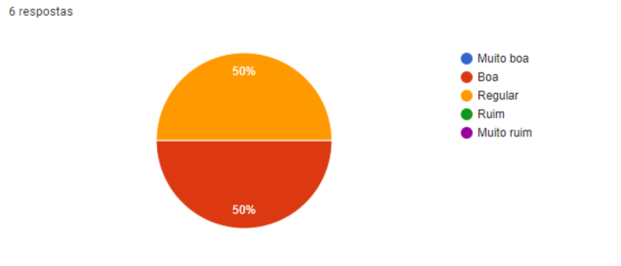
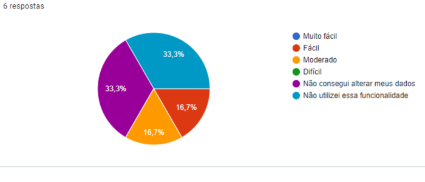
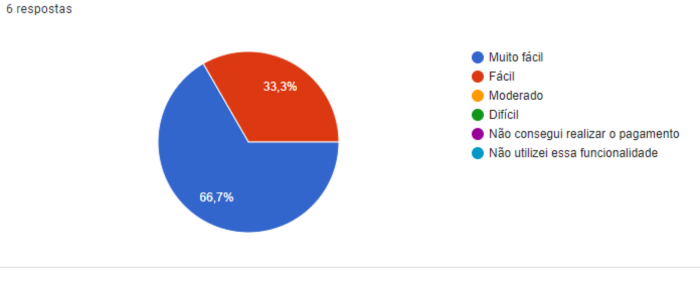
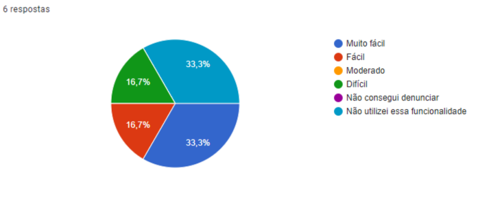
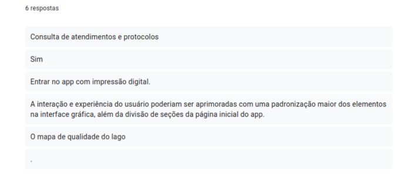
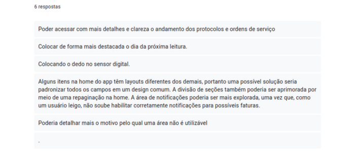
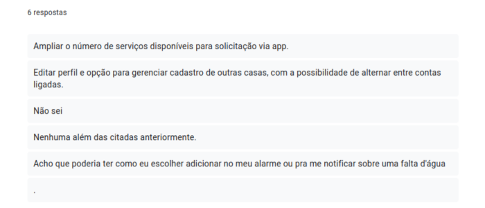
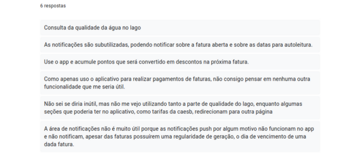

# Questionário
## Introdução
Para poder realizar a elicitação de requisitos dos usuários do aplicativo CAESB Autoatendimento, primeiro foi necessário que fosse concluído o perfil de usuário, aonde nessa parte conseguimos o contato com os usuários e a partir disso foi se utilizado o método de Pesquisa/Questionário.

Esse método foi escolhido devido a suas vantagens, sendo algumas delas:

* Técnica Relativamente rápida e barata de ser aplicada
* Obtenção de maneira mais fácil de informações de um grupo numeroso
* Geração de dados quantitativos para análise estatística.

Porém, deve se lembrar que essa técnica também possui algumas desvantagens, como:

* Uma falha no questionário pode levar respostas em branco ou incorretas
* Uma má elaboração pode gerar interpretações distintas da mesma pergunta.

Diante disso, se decidiu realizar um formulário online, onde estavam presentes questões com respostas limitadas, onde se puderem retirar dados quantitativos, como também questões de respostas livres que possibilitaram aos usuários se expressarem como quiserem sobre experiências e desejos que gostaria de ver no aplicativo.

## Termo de Conscientemente
É importante também deixar registrado que antes de responderem o questionário, todos os participantes concordaram de boa-fé com a utilização dos dados que eles forneceram para fins acadêmicos, podendo ser observado na figura 1.

 Figura 1 (Fonte: Autores, 2023).

## As Questões
### Questão 1
- Considerando a aparência visual e a facilidade de uso do aplicativo da CAESB, como você avalia a sua interface? Respostas presentes na imagem Resultado 1.
   

 Resultado 1 (Fonte: Autores, 2023).

### Questão 2

- Como você avalia a acessibilidade do aplicativo da CAESB, considerando a facilidade de navegação, as opções disponíveis para auxiliar pessoas com deficiência visual ou auditiva, entre outros aspectos? Respostas presentes na imagem Resultado 2.

 Resultado 2 (Fonte: Autores, 2023).

### Questão 3

- Como você avalia o gerenciamento de senha e personalização da sua conta no aplicativo da CAESB? Respostas presentes na imagem Resultado 3.

 Resultado 3 (Fonte: Autores, 2023).

### Questão 4

- Como você avalia a facilidade de realizar o pagamento de uma fatura no aplicativo? Respostas presentes na imagem Resultado 4.

 Resultado 4 (Fonte: Autores, 2023).

### Questão 5

- Como você avalia a facilidade em denunciar vazamento de água na rua pelo aplicativo? Respostas presentes na imagem Resultado 5.

 Resultado 5 (Fonte: Autores, 2023).

### Questão 6

- Existe alguma outra funcionalidade do aplicativo da CAESB que você acredita que possa ser aprimorada? Respostas presentes na imagem Resultado 6.

 Resultado 6 (Fonte: Autores, 2023).

### Questão 7

- Caso positivo, por favor, descreva como essa funcionalidade poderia ser aprimorada. Respostas presentes na imagem Resultado 7.

 Resultado 7 (Fonte: Autores, 2023).

### Questão 8

- Em relação as funcionalidades já presentes, quais melhorias você gostaria de ver no aplicativo da CAESB? Respostas presentes na imagem Resultado 8.

 Resultado 8 (Fonte: Autores, 2023).

### Questão 9

- Você acha que o aplicativo da CAESB possui alguma funcionalidade que não seja tão útil ou necessária? Se sim, qual seria essa funcionalidade?  Respostas presentes na imagem Resultado 9.

 Resultado 9 (Fonte: Autores, 2023).

## Requisitos Elicitados

Analisando os dados coletados a partir do questionário, contendo perguntas qualitativas e quantitativas, podemos elicitar a seguinte lista de requisitos:

|Identificador|Descrição|Funcional/Não Funcional|Implementado|
|:-:|:-:|:-:|:-:|
| Q01 | O usuário deve poder consultar a sua fatura | RF | Sim |
| Q02 | Notificar usuário que a fatura está próxima do vencimento | RF | Não |
| Q03 |	O usuário deve poder pegar a 2ª via da fatura | RF | Sim |
| Q04 |	O aplicativo deve permitir que o usuário cadastre cartões de crédito/débito | RF | Sim |
| Q05 |	O aplicativo deve permitir que o usuário copie o código do boleto  | RNF | Sim |
| Q06 |	O usuário deve possuir uma forma de pagamento por cartão que seja automática | RNF | Não |
| Q07 | O aplicativo deve seguir as diretrizes de acessibilidade da WACG 2.1 [1], garantindo que seja acessível para pessoas com deficiência visual, auditiva ou física. | RF | Sim |
| Q08 |	A possibilidade de se utilizar cadastros de outras casas, podendo haver, por exemplo, um sistema de troca de contas | RNF | Não |
| Q09 | O usuário deve poder solicitar serviço (CRU) | RF | Sim|
| Q10 |	O usuário deve poder acessar sua conta por meio de sua impressão digital previamente cadastrada | RNF | Não |
| Q11 | O usuário deve ser notificado sobre falta de água em sua região | RF | Não |
| Q12 |	O aplicativo deve apresentar uma divisão clara de seções | RF | Sim |
| Q13 |	O aplicativo deve padronizar todos os itens que aparecem nas suas seções | RF | Sim |
| Q14 |	Deve se ter mais detalhe e clareza com relação aos protocolos e serviços | RF | Sim |
| Q15 |	Apresentar quando que ocorrerá uma próxima leitura | RF | Não |
| Q16 |	O aplicativo deve informar o motivo para a qualidade de banho em uma área do lago não ser a ideal | RNF | Não |
| Q17 |	O usuário deve poder informar sobre vazamentos | RF | Sim |

**Legenda**:
- RF: Requisito Funcional
- RNF: Requisito Não Funcional
- Q: Questionário

## Referências
> VAZQUEZ, Carlos Eduardo - Engenharia de requisitos: software orientado ao negócio.

## Histórico de Versão

| Data | Data Prevista de Revisão | Versão | Descrição | Autor | Revisor |
| :--: | :--: | :--: | :--: | :--: | :--: |
| 30/04/2023 | 30/04/2023 |  1.0   | Questionário para Elicitação | [Daniel](https://github.com/daniel-de-sousa) e [Pedro](https://github.com/pedrobarbosaocb) | [Guilherme](https://github.com/guilhermekishimoto) |
