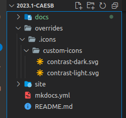

# Ícones Personalizados

<h4>Nesse projeto, estamos utilizando a extensão Material do MKDocs que possui mais de 8,000 ícones prontos para uso. Porém, estarei tratando nesta página acerca da adição de ícones foras dos já presentes nas extensões utilizadas.</h4>

## Preparando o Ambiente

Para adicionar ícones próprios, é necessário, primeiramente configurar a pasta que irá o contê-lo e os seus demais ícones personalizados:
<br>

   1. No mesmo diretório que contém o arquivo **mkdocs.yml**, adicione o arquivo svg do seu ícone criando a seguinte sequência de pastas: `overrides ➔ .icons ➔ custom-icons`. A Figura 1, ilustra a estrutura em que seu diretório deve estar após a adição do ícone.

      <center></center>

      <p><center> Figura 1: Estrutura das Pastas. (Fonte: Autor, 2023).</center></p>

   2. Adicionar as seguintes linhas ao arquivo **mkdocs.yml** :
   ```
   markdown_extensions:
     - pymdownx.emoji:
         emoji_index: !!python/name:materialx.emoji.twemoji
         emoji_generator: !!python/name:materialx.emoji.to_svg
         options:
           custom_icons:
             - overrides/.icons
   ```

   3. Adicione a seguinte linha, dentro de **theme**, ao arquivo **mkdocs.yml** . Referenciando, assim, o diretório **overrides**.
   ```
   custom_dir: overrides
   ```

## Adicionando os Ícones

Após adicionar a referência a pasta **overrides**, basta adicionar seu icone a pasta **custom-icons** dentro te **overrides/.icons**, e referenciá-lo. Há duas formas de adicionar o seu ícone:
   
   1. No arquivo de configuração:
      - `icon: custom-icons/<nome-do-seu-icone>`
   
   2. Ou, em meio ao aquivo md:
      - `:custom-icons-<nome-do-seu-icone>:`


# Referências

> Utilizando ícones personalizados em Markdown (Using custom icons in Markdown). Disponível no [link](https://github.com/squidfunk/mkdocs-material/discussions/5199).

> Alterando ícones e a Logo (Changing the logo and icons). Disponível no [link](https://squidfunk.github.io/mkdocs-material/setup/changing-the-logo-and-icons/#additional-icons).

## Histórico de Versão
|    Data    | Data Prevista de Revisão | Versão |      Descrição       |                                                                Autor                                                                 |               Revisor               |
| :--------: | :----------------------: | :----: | :------------------: | :----------------------------------------------------------------------------------------------------------------------------------: | :---------------------------------: |
| 25/04/2023 |        25/04/2023        |  1.0   | Guia de Ícones Personalizados | [Pedro](https://github.com/pedrobarbosaocb) | [Carla](https://github.com/ccarlaa) |
| 27/04/2023 |        27/04/2023        |  2.0   | Guia de Ícones Personalizados | [Pedro](https://github.com/pedrobarbosaocb) | [Raquel](https://github.com/ccarlaa) |