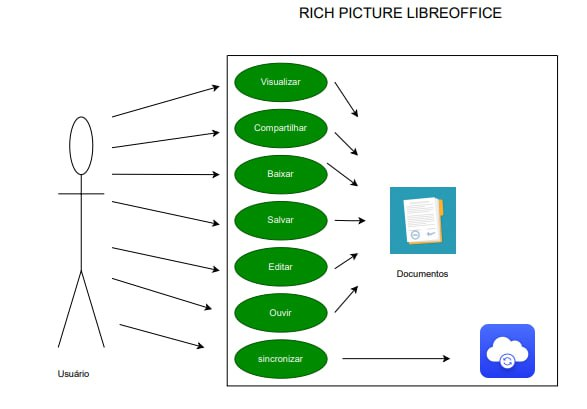
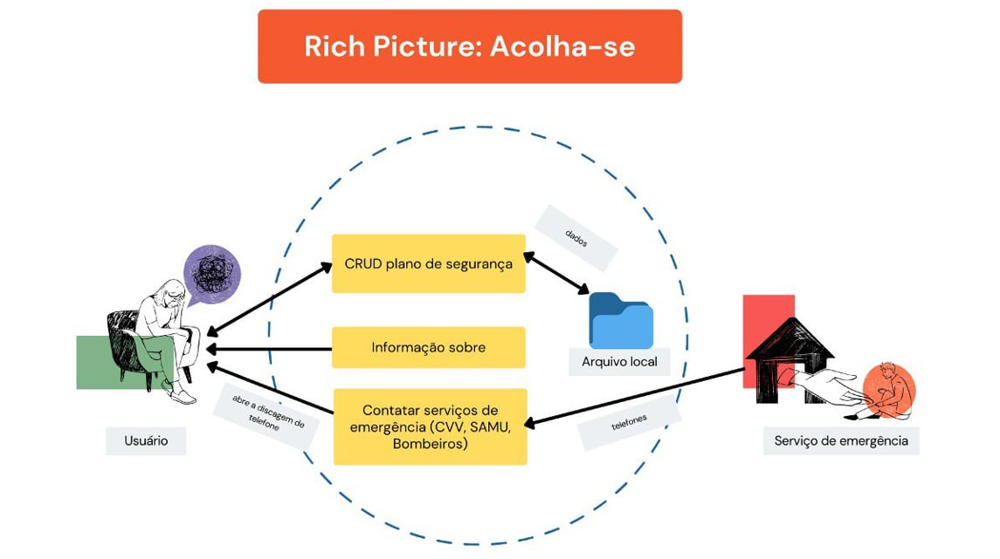

# Aplicativos Analisados

## Introdução
Para o projeto da disciplina é necessário ser escolhido um aplicativo para que o grupo trabalhe com ele, sendo necessário que seus termos permitam isso, tendo isso em mente, cada integrante pesquisou sobre um aplicativo, sendo todos listados abaixo:

## Metodologias
Para a escolha do aplicativo, cada integrante montou uma Rich Picture relativa a uma das possíveis escolhas para o projeto. Sendo assim, Com base nisso o grupo se baseou e escolheu a que fosse de maior agrado. Dessa forma, abaixo será apresentado os critérios de escolha do aplicativo, o que foi escrito sobre o aplicativo escolhido de cada integrante, e além disso a   rich picture realizada por estes. 
  
## Critérios Discutidos Para a Escolha Do Aplicativo
Após a seleção individual de cada integrante , o grupo decidiu o aplicativo a partir dos seguintes critérios:
- O aplicativo não poderia ter sido trabalhado anteriormente na disciplina de Requisitos de Software
- O aplicativo precisa ser um software livre ou do governo, e deve permitir a engenharia reversa e análise completa deste
- O aplicativo deve ser profundo o sufiicente para poder ser realizado uma análise completa
    
## O que é Rich Picture
Rich picture é uma modelagem cuja notação permite analisar problemas e expressar ideias. Sua vantagem é que ele se trata de um modelo informal e fácil de entender, podendo ser construido de forma colaboratória para identificação de projetos e requisitos de negócio. Sendo assim , os rich pictures de cada integrante serão apresentados abaixo.

## Aplicativos Individuais

**1. GitHub**

O Github é uma aplicação lançada em 2008 que tem por objetivo possibilitar a seus usuários a hospedagem de seus projetos e o controle de suas versões por meio da ferramenta Git. Além disso, a possibilidade de várias pessoas poderem trabalhar em um projeto ao mesmo tempo tornou a plataforma extremamente atrativa para os desenvolvedores, chegando a ter mais de 5 milhões de repositórios hospedados.

GitHub Rich Picture | Autor: Carla de Araujo | [PDF]()

**2. Serasa**

O aplicativo do Serasa é um aplicativo desenvolvido pelo governo, e foi criado para permitir que o usuário consulte o CPF para analisar dividas, protestos, consulta CNPJ, além de outras informações. além disso ele permite que seja negociado dívidas no nome da pessoa ou da empresa.

GitHub Rich Picture | Autor: Guilherme Kishimoto | [PDF]()

**3. iLovePDF**

O aplicativo iLovePDF serve para que se possa realizar o gerenciamento de documentos através do celular, mais precisamente trabalhando com PDF, apresentando funções como:

* Escaneador de Telefone.
* Conversor de PDF.
* Editor de PDF.

Sendo limitado seu uso, oferecendo

GitHub Rich Picture | Autor: Pedro Barbosa | [PDF]()

**4. LibreOffice Reader**

O aplicativo do LibreOffice  é um software desenvolvido e conduzido pela comunidade, e é um projeto da organização sem fins lucrativos "The Document Foundation". Suas funções incluem abrir, copiar, encaminhar, editar, buscar e salvar documentos, e basicamente funciona como uma suite de escritório

GitHub Rich Picture | Autor: Paulo Victor | [PDF]()

**5. Acolha-se**

O aplicativo Acolha-se  é um software desenvolvido e conduzido por voluntários e sem fins lucrativos. Basicamente você cria um plano de segurança, onde é registrado informações pessoais importantes para o enfrentamento de crises e ideações. Além de disponibilizar o contato de serviços de emergência como CVV, SAMU e bombeiros.

GitHub Rich Picture | Autor: Raquel Eucaria | [PDF]()

**6. CAESB Autoatendimento**

O aplivativo da CAESB (Companhia de Saneamento Ambiental do Distritu Federal) foi criado com o objetivo de se ter praticidade, permitindo que o usuário tenha acesso a diversos recursos, como:

* Avisos sobre a Falta de Água.
* Qualidade de Água em Lagos.
* Informações em Geral para os Usuários.

Como também permite que o usuário ajude o trabalho da CAESB pelo recurso de poder informar onde se tem um vazamento para que possa ser corrigido.
A paritr do momento que o usuário se conecta, também é possível ter acesso a outros serviços, como:

* 2° Via de Conta.
* Informar Falta de Água.
* Alterar Titularidade.
* Entre outros.

GitHub Rich Picture | Autor: Daniel dos Santos | [PDF]()

## Referências

SERRANO, Maurício; SERRANO, Milene. Requisitos - Aula 4. 1º/2019. 37 slides. Material apresentado para a disciplina de Requisitos de Software no curso de Engenharia de Software da UnB, FGA.

Andrew Monk and Steve Howard. 1998. Methods & tools: the rich picture: a tool for reasoning about work context. interactions 5, 2 (March/April 1998), 21–30. 

## Histórico de Versão
|    Data    | Data Prevista de Revisão | Versão |      Descrição       |                                                                Autor                                                                 |               Revisor               |
| :--------: | :----------------------: | :----: | :------------------: | :----------------------------------------------------------------------------------------------------------------------------------: | :---------------------------------: |
| 14/04/2023 |        15/04/2023        |  1.0   | Criação do documento | [Daniel](https://github.com/daniel-de-sousa), [Paulo](https://github.com/PauloVictorFS) e [Raquel](https://github.com/raqueleucaria) | Todos |