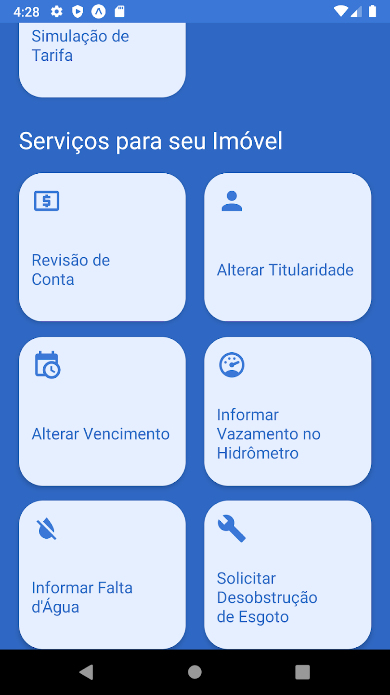
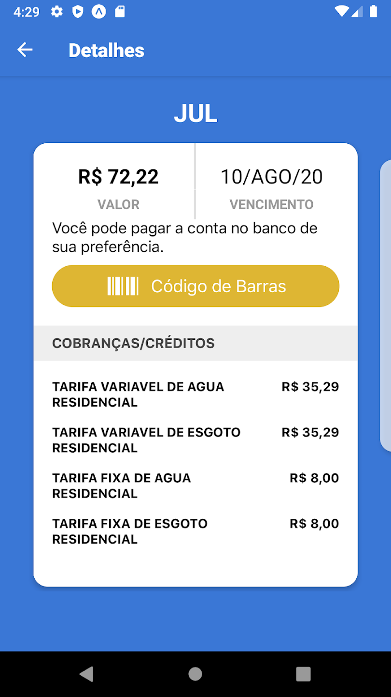
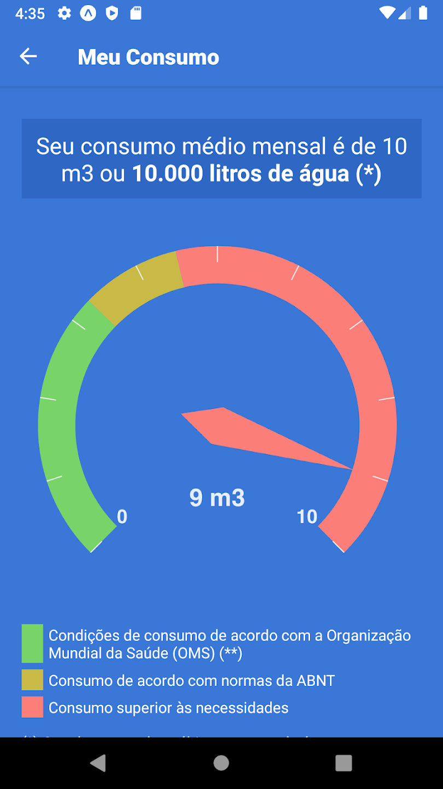

# Aplicativo Escolhido:

## Aplicativos analisados:

Para a escolha do aplicativo, cada integrante montou uma Rich Picture relativa a uma das possíveis escolhas para o projeto. Sendo assim, Com base nisso o grupo se baseou e escolheu a que fosse de maior agrado. Dessa forma, abaixo será apresentado os critérios de escolha do aplicativo, o que foi escrito sobre o aplicativo escolhido de cada integrante, e além disso a  rich picture realizada por estes. na tabela a seguir é possível observar a escolha de cada integrante e o rich picture produzido.

| Nome                | Aplicativo            | Rich Picture     |
| ------------------- | --------------------- | ---------------- |
| Caetano Santos      |                       | [Rich Picture]() |
| Carla de Araujo     | GitHub                | [Rich Picture]() |
| Daniel dos Santos   | CAESB Autoatendimento | [Rich Picture]() |
| Guilherme Kishimoto | Serasa                | [Rich Picture]() |
| Paulo VIctor        | LibreOffice Reader    | [Rich Picture]() |
| Pedro Barbosa       | iLovePDF              | [Rich Picture]() |
| Raquel Eucaria      | Acolha-se             | [Rich Picture]() |

## Aplicativo definido

Após a seleção individual de cada integrante, o grupo decidiu que o aplicativo seria o da Caesb a partir dos seguintes critérios:

- O aplicativo não poderia ter sido trabalhado anteriormente na disciplina de Requisitos de Software
- O aplicativo precisa ser um software livre ou do governo, e deve  permitir a engenharia reversa e análise completa deste
- O aplicativo deve ser profundo o sufiicente para poder ser realizado uma análise completa

## Caesb

O aplivativo da CAESB (Companhia de Saneamento Ambiental do Distritu Federal) foi criado com o objetivo de se ter praticidade, permitindo que o usuário tenha acesso a diversos recursos, como:

* Avisos sobre a Falta de Água.
* Qualidade de Água em Lagos.
* Informações em Geral para os Usuários.

Como também permite que o usuário ajude o trabalho da CAESB pelo recurso de poder informar onde se tem um vazamento para que possa ser corrigido.
A paritr do momento que o usuário se conecta, também é possível ter acesso a outros serviços, como:

* 2° Via de Conta.
* Informar Falta de Água.
* Alterar Titularidade.
* Entre outros.

Segue abaixo a pagina do aplicativo na Play Store

|  |  |  |  |  |  |
| ---------------------------------------------------------------------------- | ---------------------------------------------------------------------------- | ---------------------------------------------------------------------------- | ---------------------------------------------------------------------------- | ---------------------------------------------------------------------------- | ---------------------------------------------------------------------------- |

## Histórico de Versão
|    Data    | Data Prevista de Revisão | Versão |      Descrição       |                                         Autor                                          |               Revisor               |
| :--------: | :----------------------: | :----: | :------------------: | :------------------------------------------------------------------------------------: | :---------------------------------: |
| 14/04/2023 |        15/04/2023        |  1.0   | Criação do documento | [Paulo](https://github.com/PauloVictorFS) e [Raquel](https://github.com/raqueleucaria) | [Carla](https://github.com/ccarlaa) |